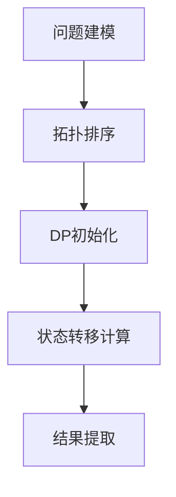

## 语法基础

---
### **一、常用容器**
#### 1. `vector`（动态数组）
- **用途**：替代普通数组，动态扩缩容
- **核心操作**：
  ```cpp
  vector<int> v;
  v.push_back(3);          // 尾部插入
  v.pop_back();            // 尾部删除
  v.size();                // 元素数量
  v.clear();               // 清空
  v.front() / v.back();     // 首尾元素
  v.resize(100);           // 调整大小
  ```
#### 2. `queue`（队列）
- **用途**：BFS、FIFO操作
- **核心操作**：
  ```cpp
  queue<int> q;
  q.push(1);               // 入队
  q.pop();                 // 出队（不返回值）
  q.front();               // 队首元素
  q.empty();               // 判空
  ```
#### 3. `stack`（栈）
- **用途**：DFS、FILO操作
- **核心操作**：
  ```cpp
  stack<int> s;
  s.push(1);               // 入栈
  s.pop();                 // 出栈（不返回值）
  s.top();                 // 栈顶元素
  s.empty();               // 判空
  ```
#### 4. `set` / `map`（红黑树）
- **用途**：有序集合/键值对
- **核心操作**：
  ```cpp
  set<int> st;
  st.insert(3);            // 插入（自动去重）
  st.erase(3);             // 删除值
  st.count(3);             // 存在性检查
  auto it = st.lower_bound(2); // >=2的最小元素

  map<string, int> mp;
  mp["key"] = 5;           // 插入或修改
  mp.find("key");          // 返回迭代器
  ```
#### 5. `unordered_set` / `unordered_map`（哈希表）
- **用途**：快速查找（平均O(1)）
- **注意**：不支持排序，C++11起可用
  ```cpp
  unordered_set<int> us;
  us.insert(3);
  us.erase(3);
  ```
#### 6. `priority_queue`（优先队列）
- **用途**：堆（默认最大堆）
- **核心操作**：
  ```cpp
  priority_queue<int> pq;       // 最大堆
  pq.push(3);                   // 插入
  pq.pop();                     // 删除堆顶
  pq.top();                     // 堆顶元素（最大值）

  // 最小堆
  priority_queue<int, vector<int>, greater<int>> min_heap;
  ```
#### 7. `deque`（双端队列）
- **用途**：队头队尾均可操作
  ```cpp
  deque<int> dq;
  dq.push_back(1);   // 尾插
  dq.push_front(2);  // 头插
  dq.pop_back();     // 尾删
  dq.pop_front();    // 头删
  ```
#### 8. `pair` / `tuple`（复合类型）
- **用途**：存储键值对或多值
  ```cpp
  pair<int, string> p = {3, "abc"};
  tuple<int, double, char> t = {1, 2.0, 'a'};
  auto [a, b, c] = t;  // C++17结构化绑定
  ```

---
### **二、常用算法**
#### 1. 排序与查找
```cpp
#include <algorithm>
sort(v.begin(), v.end());                 // 排序（默认升序）
sort(v.rbegin(), v.rend());               // 降序排序
reverse(v.begin(), v.end());              // 反转

auto it = find(v.begin(), v.end(), val);  // 线性查找
binary_search(v.begin(), v.end(), val);   // 二分查找（需已排序）
auto it_low = lower_bound(v.begin(), v.end(), val); // >=val的位置
auto it_up = upper_bound(v.begin(), v.end(), val);  // >val的位置
```
#### 2. 去重操作
```cpp
// 排序后去重（注意容器需支持随机访问）
sort(v.begin(), v.end());
auto last = unique(v.begin(), v.end()); 
v.erase(last, v.end()); // 移除重复元素
```
#### 3. 遍历与函数
```cpp
// Lambda表达式（匿名函数）
for_each(v.begin(), v.end(), [](int x) {
    cout << x << " ";
});

// 最大值/最小值
max_element(v.begin(), v.end());
min_element(v.begin(), v.end());
```
#### 4. 数值运算
```cpp
#include <numeric>
accumulate(v.begin(), v.end(), 0);     // 累加
partial_sum(v.begin(), v.end(), res);// 前缀和
```

```c
#include <algorithm>
#include <vector>
#include <iostream>
#include <set>
using namespace std;

int main() {
    vector<int> v = {3,1,4,2,5}, w = {1,2,3};
    
    // ========== 排序操作 ==========
    sort(v.begin(), v.end());    // 排序: v->{1,2,3,4,5}
    stable_sort(v.begin(), v.end());  // 稳定排序
    partial_sort(v.begin(), v.begin()+3, v.end());  // 部分排序

    // ========== 查找操作 ==========
    auto it = find(v.begin(), v.end(), 4);       // 查找元素
    int cnt = count(v.begin(), v.end(), 3);      // 计数
    bool has5 = binary_search(v.begin(), v.end(), 5);  // 二分查找

    // ========== 边界操作 ==========
    auto lb = lower_bound(v.begin(), v.end(), 3);  // ≥3的第一个位置
    auto ub = upper_bound(v.begin(), v.end(), 3);  // >3的第一个位置
    
    // ========== 容器操作 ==========
    set<int> s(v.begin(), v.end());
    includes(v.begin(), v.end(), w.begin(), w.end());  // 包含判断
    merge(v.begin(), v.end(), w.begin(), w.end(), v.begin()); // 合并
    
    // =========️= 数值处理 ==========
    replace(v.begin(), v.end(), 2, 99);   // 替换元素 (2→99)
    remove(v.begin(), v.end(), 3);        // 移除元素
    reverse(v.begin(), v.end());          // 逆序
    
    // ========== 最值操作 ==========
    auto mx = *max_element(v.begin(), v.end());  // 最大值
    auto mn = *min_element(v.begin(), v.end());  // 最小值
    
    // ========== 排列组合 ==========
    next_permutation(v.begin(), v.end());  // 下一排列
    prev_permutation(v.begin(), v.end());  // 上一排列
    
    // ========== 比较操作 ==========
    is_sorted(v.begin(), v.end());        // 是否有序
    equal(v.begin(), v.end(), w.begin()); // 相等判断
    
    // ========== 集合操作 ==========
    set_union(s1.begin(), s1.end(), s2.begin(), s2.end(), result); 
    set_difference(s1.begin(), s1.end(), s2.begin(), s2.end(), result);
}

```
---
### **三、高性能技巧**
1. **预分配内存**（减少扩容开销）：
   ```cpp
   vector<int> v;
   v.reserve(100000); // 预分配空间
   ```
2. **减少拷贝**：
   - 使用 `emplace_back()` 替代 `push_back()`：
     ```cpp
     v.emplace_back(3); // 直接构造，省去临时对象拷贝
     ```
1. **移动语义**（C++11+）：
   ```cpp
   vector<int> v2 = std::move(v1); // 移动而非拷贝
   ```
2. **使用迭代器替代下标访问**：
   ```cpp
   for (auto it = v.begin(); it != v.end(); ++it) {
       *it += 1; // 避免随机访问开销
   }
   ```
---
### **四、易错点**
1. `map`的`[]`操作符会自动插入键。检查存在性用`find`或`count`。
2. `priority_queue`的默认大顶堆用`less<T>`实现，逻辑反直觉。
3. 迭代器失效问题：修改`vector`/`deque`可能导致迭代器失效。
4. `unordered_map/set`自定义哈希函数：
   ```cpp
   struct CustomHash {
       size_t operator()(const Key& key) const {
           return hash_val(key); // 自定义哈希逻辑
       }
   };
   unordered_map<Key, Val, CustomHash> myMap;
   ```

---
### **五、样例代码**
```cpp
#include <bits/stdc++.h>
using namespace std;
int main() {
    // vector + sort
    vector<int> v = {3,1,4,5,2};
    sort(v.begin(), v.end()); // -> {1,2,3,4,5}
    // map查询
    map<string, int> dict;
    dict["Alice"] = 99;
    if (dict.count("Alice")) 
        cout << dict["Alice"];  // 输出99
    // 优先队列（最小堆）
    priority_queue<int, vector<int>, greater<int>> pq;
    pq.push(3); pq.push(1); 
    cout << pq.top(); // 输出1
    // 去重
    vector<int> vec = {1,2,2,3,3,3};
    sort(vec.begin(), vec.end());
    auto last = unique(vec.begin(), vec.end());
    vec.erase(last, vec.end()); // -> {1,2,3}
    return 0;
}
```
---
#### 高精度计算
```c
#include <stdio.h>
#include <stdlib.h>
#include <iostream>  
#include <string>  
#include <cstring>  
#include <cstdio>  
using namespace std;  
const int maxn = 1000;  
struct bign{  
    int d[maxn], len;  
  
    void clean() { while(len > 1 && !d[len-1]) len--; }  
  
    bign()          { memset(d, 0, sizeof(d)); len = 1; }  
    bign(int num)   { *this = num; }   
    bign(char* num) { *this = num; }  
    bign operator = (const char* num){  
        memset(d, 0, sizeof(d)); len = strlen(num);  
        for(int i = 0; i < len; i++) d[i] = num[len-1-i] - '0';  
        clean();  
        return *this;  
    }  
    bign operator = (int num){  
        char s[20]; sprintf(s, "%d", num);  
        *this = s;  
        return *this;  
    }  
  
    bign operator + (const bign& b){  
        bign c = *this; int i;  
        for (i = 0; i < b.len; i++){  
            c.d[i] += b.d[i];  
            if (c.d[i] > 9) c.d[i]%=10, c.d[i+1]++;  
        }  
        while (c.d[i] > 9) c.d[i++]%=10, c.d[i]++;  
        c.len = max(len, b.len);  
        if (c.d[i] && c.len <= i) c.len = i+1;  
        return c;  
    }  
    bign operator - (const bign& b){  
        bign c = *this; int i;  
        for (i = 0; i < b.len; i++){  
            c.d[i] -= b.d[i];  
            if (c.d[i] < 0) c.d[i]+=10, c.d[i+1]--;  
        }  
        while (c.d[i] < 0) c.d[i++]+=10, c.d[i]--;  
        c.clean();  
        return c;  
    }  
    bign operator * (const bign& b)const{  
        int i, j; bign c; c.len = len + b.len;   
        for(j = 0; j < b.len; j++) for(i = 0; i < len; i++)   
            c.d[i+j] += d[i] * b.d[j];  
        for(i = 0; i < c.len-1; i++)  
            c.d[i+1] += c.d[i]/10, c.d[i] %= 10;  
        c.clean();  
        return c;  
    }  
    bign operator / (const bign& b){  
        int i, j;  
        bign c = *this, a = 0;  
        for (i = len - 1; i >= 0; i--)  
        {  
            a = a*10 + d[i];  
            for (j = 0; j < 10; j++) if (a < b*(j+1)) break;  
            c.d[i] = j;  
            a = a - b*j;  
        }  
        c.clean();  
        return c;  
    }  
    bign operator % (const bign& b){  
        int i, j;  
        bign a = 0;  
        for (i = len - 1; i >= 0; i--)  
        {  
            a = a*10 + d[i];  
            for (j = 0; j < 10; j++) if (a < b*(j+1)) break;  
            a = a - b*j;  
        }  
        return a;  
    }  
    bign operator += (const bign& b){  
        *this = *this + b;  
        return *this;  
    }  
  
    bool operator <(const bign& b) const{  
        if(len != b.len) return len < b.len;  
        for(int i = len-1; i >= 0; i--)  
            if(d[i] != b.d[i]) return d[i] < b.d[i];  
        return false;  
    }  
    bool operator >(const bign& b) const{return b < *this;}  
    bool operator<=(const bign& b) const{return !(b < *this);}  
    bool operator>=(const bign& b) const{return !(*this < b);}  
    bool operator!=(const bign& b) const{return b < *this || *this < b;}  
    bool operator==(const bign& b) const{return !(b < *this) && !(b > *this);}  
    string str() const{  
        char s[maxn]={};  
        for(int i = 0; i < len; i++) s[len-1-i] = d[i]+'0';  
        return s;  
    }  
};  
istream& operator >> (istream& in, bign& x)  
{  
    string s;  
    in >> s;  
    x = s.c_str();  
    return in;  
}  
ostream& operator << (ostream& out, const bign& x)  
{  
    out << x.str();  
    return out;  
}
```
#### 输入输出
- iostream解除兼容：`std::ios::sync_with_stdio(false)`​(解除兼容后不应该混用stdio)
#### 优先队列比较函数

```cpp

struct Node {
    int value;
    int priority;
};
// 方式1：仿函数作为比较器（推荐）
struct CompareNode {
    bool operator()(const Node& a, const Node& b) const { 
        // 返回true表示a的优先级低于b（即a比b靠后）
        return a.priority > b.priority;  // 创建最小堆
    }
};
int main() {
    // 最小堆声明
    std::priority_queue<Node, std::vector<Node>, CompareNode> minHeap;  
    // 最大堆演示（默认就是最大堆）
    struct MaxComparator {
        bool operator()(const int a, const int b) const { 
            return a < b;  // 返回true表示a优先级低于b
        }
    };
    std::priority_queue<int, std::vector<int>, MaxComparator> maxHeap;
    minHeap.push({1, 5});
    minHeap.push({2, 3});  // 这个将出现在顶部（priority=3最小）
}

```

#### 最大最小值

- 头文件
- 函数描述
#### OOP写法
```c
class Person {
private:
    // 数据成员（私有）
    string name;
    int age;
protected:
    // 受保护的（可由派生类访问）
    string id;  
public:
    // 构造函数
    Person(string n, int a) : name(n), age(a) {
        cout << "Person created: " << name << endl;
    } // 析构函数
    ~Person() {
        cout << "Person destroyed: " << name << endl;
    }    // 方法（公开）
    void introduce() {
        cout << "I'm " << name << ", " << age << " years old.\n";
    }  // Getter方法
    string getName() const { 
        return name; 
    }// Setter方法
    void setAge(int newAge) { 
        age = newAge; 
    }
};

```
- 实例化
```c
int main() {
    // 在栈上创建对象
    Person alice("Alice", 30);
    alice.introduce();
    
    // 在堆上创建对象
    Person* bob = new Person("Bob", 25);
    bob->introduce();
    
    delete bob; // 释放内存
    return 0;
}
```
- 构造函数示例
```c
#include <iostream>
#include <utility> // std::move
struct Point {
    int x, y;
    Point() : x(0), y(0) {} // 默认构造函数
    Point(int x, int y) : x(x), y(y) {} // 带参数构造函数
};
class ArrayWrapper {
    int* data;
```
## 算法基础

#### 二进制枚举

```cpp
int n = ...;  // 元素数量
const int stateCount = 1 << n;  // 总状态数
// 状态枚举
for (int state = 0; state < stateCount; state++) {
    // 位检查
    for (int i = 0; i < n; i++) {
        if (state & (1 << i)) {  // 检查第i位是否为1
            // 处理选中状态
        }
    }
    // 处理当前状态...
}
```

#### 快速幂函数

```cpp
long long binpow(long long a, long long b) {
  long long res = 1;
  while (b > 0) {
    if (b & 1) res = res * a;
    a = a * a;
    b >>= 1;
  }
  return res;
}
```

```cpp
long long binpow(long long a, long long b, long long m) {
  a %= m;
  long long res = 1;
  while (b > 0) {
    if (b & 1) res = res * a % m;
    a = a * a % m;
    b >>= 1;
  }
  return res;
}//用于在模意义下取幂
```

## 数据结构

#### 单调栈
单调栈是一种特殊的栈结构，它通过维护栈内元素的**单调性**来解决特定问题。其核心特征是：**栈内元素始终保持单调递增或递减的顺序**（从栈底到栈顶）。
###### 核心思想
1. **数据筛选原则**：
    - 当新元素即将入栈时
    - 如果会破坏已有单调性
    - 则不断弹出栈顶元素，直到满足单调性
    - 新元素再入栈
2. **问题解决范式**：常用于解决"**第一个更大/更小元素**"类问题
```c++
vector<int> nextGreaterElement(vector<int>& nums) {
    int n = nums.size();
    vector<int> res(n, -1);
    stack<int> stk; // 单调递减栈（从栈底到栈顶递减）
    for (int i = 0; i < n; i++) {
        while (!stk.empty() && nums[i] > nums[stk.top()]) {
            int idx = stk.top();
            stk.pop();
            res[idx] = nums[i];
        }
        stk.push(i);
    }
    return res;
}
```
#### 并查集（DSU）

- 代码实现

  ```cpp
  int find_set(int v) {
      if (v == parent[v])
          return v;
      return parent[v] = find_set(parent[v]);
  }

  void make_set(int v) {
      parent[v] = v;
      size_set[v] = 1;
  }

  void union_sets(int a, int b) {
      a = find_set(a);
      b = find_set(b);
      if (a != b) {
          if (size_set[a] < size_set[b])
              swap(a, b);
          parent[b] = a;
          size_set[a] += size_set[b];
      }
  }
  ```

  - #### parent为数组，用于储存父节点，size_set为数组，用于储存所在集合的大小

## 搜索专题

#### 0-1BFS

- 实现思路：一般情况下，我们把没有权值的边扩展到的点放到队首，有权值的边扩展到的点放到队尾。这样即可保证像普通 BFS 一样整个队列队首到队尾权值单调不下降。
- 伪代码实现

```cpp
while (队列不为空) {
  int u = 队首;
  弹出队首;
  for (枚举 u 的邻居) {
    更新数据
    if (...)
      添加到队首;
    else
      添加到队尾;
  }
}
```

#### 优先队列 BFS

- 实现思路：参考堆优化的Dijkstra算法

## 图论算法

#### 拓扑排序

#### 最短路

###### Floyd算法

```cpp
for (k = 1; k <= n; k++) {
  for (x = 1; x <= n; x++) {
    for (y = 1; y <= n; y++) {
      f[x][y] = min(f[x][y], f[x][k] + f[k][y]);
    }
  }
}
```

###### Dijkstra算法

```cpp
struct edge {
  int v, w;
};
struct node {
  int dis, u;
  bool operator>(const node& a) const { return dis > a.dis; }
};
vector<edge> e[MAXN];
int dis[MAXN], vis[MAXN];
priority_queue<node, vector<node>, greater<node>> q;
void dijkstra(int n, int s) {
  memset(dis, 0x3f, (n + 1) * sizeof(int));
  memset(vis, 0, (n + 1) * sizeof(int));
  dis[s] = 0;
  q.push({0, s});
  while (!q.empty()) {
    int u = q.top().u;
    q.pop();
    if (vis[u]) continue;
    vis[u] = 1;
    for (auto ed : e[u]) {
      int v = ed.v, w = ed.w;
      if (dis[v] > dis[u] + w) {
        dis[v] = dis[u] + w;
        q.push({dis[v], v});
      }
    }
  }
}
```

###### bellman-ford算法

```cpp
int dist[N],backup[N];//dist距离，backup用来存上一次的结果。
struct edge//用来存边
{
    int a;
    int b;
    int w;
}Edge[M];
int Bellman_Ford()
{
    memset(dist, 0x3f, sizeof dist);
    dist[1] = 0;//初始化
    for(int i = 0 ; i < k ; i++)//遍历k次
    {
        memcpy(backup,dist,sizeof dist);//存上一次答案。
        for(int j = 0 ; j < m ; j++)
        {
            int a = Edge[j].a, b = Edge[j].b, w = Edge[j].w;
            dist[b] = min(dist[b],backup[a] + w);
        }//遍历所有边
    }
    if(dist[n] > 0x3f3f3f3f/2) return -1;
    /*这里不像Dijkstra写等于正无穷是因为可能有负权边甚至是负环的存在，
    使得“正无穷”在迭代过程中受到一点影响。*/
    //避免正无穷值被减小
    return dist[n];
}
```

#### 最小生成树(MST)

###### prim算法

- 基本思想：类似于Dijkstra算法，计算剩余节点与已被访问节点组成的集合的最小距离
- 关键概念：集合S实现，顶点与现有集合的最短距离
- 邻接矩阵版代码实现：  

  ```cpp
  int n,G[MAXV][MAXV];
  int d[MAXV];
  bool vis[MAXV]={false};
  int prim()
  {
  	fill(d,d+MAXV,INF);
  	d[0]=0;
  	int ans=0;
  	for(int i=0;i<n;i++)
  	{
  		int u=-1,MIN=INF;
  		for(int j=0;j<n;j++)
  		{
  			if(vis[j]==false&&d[j}<MIN)
  			{
  				u=j;
  				MIN=d[j];
  			}
  		}
  	if(u==-1)return -1;//无法联通
  	vis[u]=true;
  	ans+=d[u];
  	for(int v=0;v<n;v++)
  	{
  		if(vis[v]==false&&G[u][v]!=INF&&G[u][v]<d[v})
  		{
  			d[v]=G[u][v];
  		}
  	}
  	return ans;
  }

  ```

###### Kruskal算法
- 基本策略：边贪心
- 算法思路：  
  选择剩余边中边权最小的边，如果连接的两个块不联通，则选择该边，否则舍弃此边
- 使用条件：稀疏图，顶点较多，边数较少
- 实现描述：
  为了造出一棵最小生成树，我们从最小边权的边开始，按边权从小到大依次加入，如果某次加边产生了环，就扔掉这条边，直到加入了n-1条边，即形成了一棵树。
#### 差分约束

## 字符串算法

#### 字典树算法

```cpp
struct trie {
  int nex[100000][26], cnt;
  bool exist[100000];  // 该结点结尾的字符串是否存在

  void insert(char *s, int l) {  // 插入字符串
    int p = 0;
    for (int i = 0; i < l; i++) {
      int c = s[i] - 'a';
      if (!nex[p][c]) nex[p][c] = ++cnt;  // 如果没有，就添加结点
      p = nex[p][c];
    }
    exist[p] = true;
  }
  bool find(char *s, int l) {  // 查找字符串
    int p = 0;
    for (int i = 0; i < l; i++) {
      int c = s[i] - 'a';
      if (!nex[p][c]) return 0;
      p = nex[p][c];
    }
    return exist[p];
  }
};

```
#### KMP算法
- 算法思路
  - next数组
    - 意义：所求最长相等前后缀中前缀最后一位的下标
    - 求解思路
      1. 初始化next数组，j=next[0]=-1
      2. i在1~len-1范围内遍历，执行34两步
      3. j=next[j]，直至j回退为-1，或s[j]=s[j+1]
      4. s[i]\=\=s[j+1],则next[i]=j+1;否则next[i]=j
- KMP算法代码如下：
```cpp
bool KMP(char text[],char pattern[])
{
	int n=strlen(text),m=strlen(pattern);
	getNext(pattern,m);
	int j=-1;//初始没有被匹配
	for(int i=0;i<n;i++)
	{
		while(j!=-1&&text[i]!=pattern[j+1]
		{
			j=next[j];//回退
		}
		if(text[i]==pattern[j+1]
		{
			j++;//匹配成功的情形
		}
		if(j==m-1)
		{
			return true;
		}
	}
	return false;
}
```

## 动态规划
### DAG 动态规划精简化步骤



#### 🚀 五步公式法（核心精简版）

1. **建图建模**
   - 定义节点 = 状态
   - 定义有向边 = 状态转移关系
   - 确定起点和终点
1. **拓扑排序**（确定计算顺序）
   ```python
   while 存在入度为0的节点:
       取出节点u
       遍历u的出边u→v:
           v的入度减1
       将u加入拓扑序列
   ```
2. **DP初始化**
   ```python
   dp = [最小/大值] * n 
   dp[起点] = 初始值
   ```
3. **状态转移**（按拓扑顺序迭代）
   ```python
   for 节点 in 拓扑序列:
        for 相邻节点v:
            dp[v] = min/max(dp[v], dp[u] + w(u,v))
   ```
4. **提取结果**
   `结果 = dp[终点]` 或 `最优值 = max/min(dp)`
#### 💡 实战技巧版（一句话指南）

```python
建图 → 排拓扑序 → 初始化起点 → 按序传播值 → 终点取结果
```
#### 🧠 万能模板（伪代码）

```python
def dag_dp(graph, n):
    # 1. 拓扑排序
    indegree = [0]*n
    for u in range(n):
        for v in graph[u]:
            indegree[v] += 1
    q = deque(i for i in range(n) if indegree[i]==0)
    topo = []
  
    # 2. DP初始化
    dp = [0]*n  # 根据需求改为 -∞/∞
  
    # 3. 状态转移
    while q:
        u = q.popleft()
        for v in graph[u]:
            dp[v] = max(dp[v], dp[u] + w[u][v]) # min/max
            if --indegree[v] == 0:
                q.append(v)
  
    # 4. 提取结果
    return dp[终点] if 单终点 else max(dp)
```
#### 🚨 关键要点
1. **拓扑序是核心**：确保状态转移顺序正确
2. **仅三种状态方程**：
   ```python
   最长路径: dp[v] = max(dp[v], dp[u] + w)
   最短路径: dp[v] = min(dp[v], dp[u] + w)
   路径计数: dp[v] += dp[u]  # 无权图
   ```
3. **起点初始化**：`dp[start]=0`（路径长）或 `dp[start]=1`（路径数）
4. **终点即结果**：DP结果保存在终点状态

